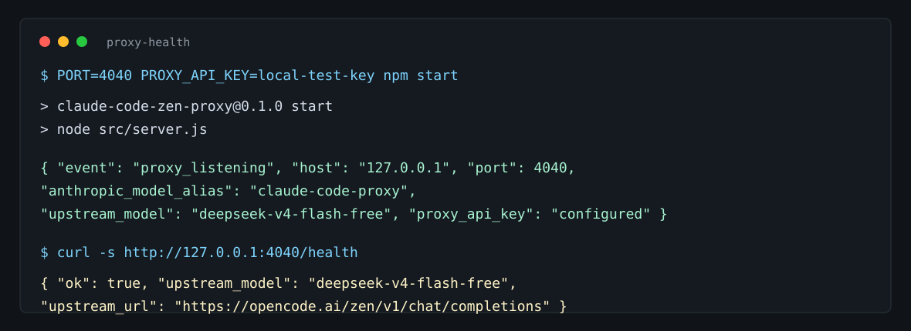
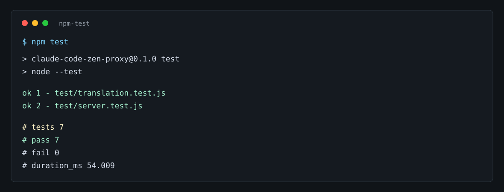
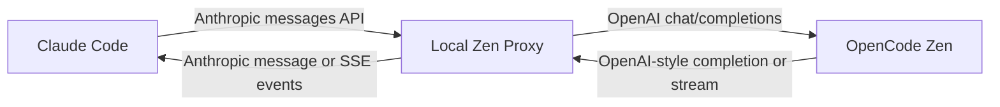

# Claude Code Zen Proxy

Anthropic-compatible local proxy for running Claude Code through OpenCode Zen or another OpenAI-compatible `chat/completions` endpoint.

The proxy accepts Claude Code's Anthropic-style `messages` API, translates requests into OpenAI-compatible chat completions, and maps responses back into Anthropic-style messages, streaming events, tool calls, and thinking blocks.

## Screenshots





## Why This Exists

Claude Code expects Anthropic-compatible endpoints. OpenCode Zen exposes an OpenAI-compatible API. This project sits between them so Claude Code can use Zen-backed models while keeping Claude Code's local configuration, tool-use flow, and streaming behavior intact.

## Features

- Anthropic-compatible `POST /v1/messages`
- Anthropic-compatible `POST /v1/messages/count_tokens`
- Anthropic-compatible `GET /v1/models` and `GET /v1/models/:id`
- OpenAI-compatible upstream `chat/completions` forwarding
- Streaming SSE translation back to Anthropic events
- Tool definition, tool call, and tool result translation
- DeepSeek thinking and reasoning effort defaults
- Lightweight Node.js runtime with built-in `node:test` coverage
- Optional `claude-zen` wrapper for keeping this setup separate from your normal `claude` command
- Cross-platform desktop GUI (Windows / Linux / macOS) with live request log and settings panel

## Architecture



The main translation layer lives in `src/anthropic-openai-proxy.js`. The HTTP server and Anthropic-compatible routes live in `src/server.js`.

## Requirements

- Node.js 20 or newer
- An OpenCode Zen API key or compatible upstream API key
- Claude Code, if you want to use the proxy from the Claude CLI

## Quick Start

Clone the repository and prepare your local environment:

```bash
cp .env.example .env.local
```

Edit `.env.local` with your upstream key:

```bash
UPSTREAM_API_KEY=your-opencode-key
UPSTREAM_MODEL=deepseek-v4-flash-free
UPSTREAM_CHAT_COMPLETIONS_URL=https://opencode.ai/zen/v1/chat/completions
ANTHROPIC_MODEL_ALIAS=claude-code-proxy
PROXY_API_KEY=choose-a-local-proxy-key
HOST=127.0.0.1
PORT=4040
```

Run the test suite:

```bash
npm test
```

Start the proxy:

```bash
./start-proxy.sh
```

Check the health endpoint:

```bash
curl -s -H 'x-api-key: choose-a-local-proxy-key' http://127.0.0.1:4040/health
```

## Claude Code Configuration

Point Claude Code at the local proxy:

```json
{
  "ANTHROPIC_BASE_URL": "http://127.0.0.1:4040",
  "ANTHROPIC_MODEL": "claude-code-proxy",
  "ANTHROPIC_API_KEY": "choose-a-local-proxy-key"
}
```

A minimal example is included in `claude-code-settings.example.json`.

## Separate `claude-zen` Wrapper

The repository also includes a wrapper script for running Claude Code through a dedicated Zen proxy process:

- `claude-zen.sh`
- `.env.zen`
- `zen-claude-settings.json`

The wrapper starts its own proxy, waits for the health check, runs Claude with the Zen-only settings file, and stops the proxy when Claude exits.

Prepare `.env.zen`, then run:

```bash
cp .env.zen.example .env.zen
# edit .env.zen and set UPSTREAM_API_KEY
./claude-zen.sh --print "Reply with exactly: zen proxy ok"
```

## API Surface

| Method | Path | Purpose |
| --- | --- | --- |
| `GET` | `/health` | Local readiness and current upstream configuration |
| `GET` | `/v1/models` | Anthropic-style model list containing the local alias |
| `GET` | `/v1/models/:id` | Anthropic-style model metadata for the configured alias |
| `POST` | `/v1/messages` | Main Claude Code message endpoint |
| `POST` | `/v1/messages/count_tokens` | Local token estimate for Claude Code budgeting |

## Configuration

| Variable | Default | Description |
| --- | --- | --- |
| `UPSTREAM_API_KEY` | empty | API key for Zen or another compatible upstream |
| `UPSTREAM_MODEL` | `deepseek-v4-flash-free` | Upstream model ID sent to `chat/completions` |
| `UPSTREAM_CHAT_COMPLETIONS_URL` | `https://opencode.ai/zen/v1/chat/completions` | OpenAI-compatible upstream endpoint |
| `ANTHROPIC_MODEL_ALIAS` | `claude-code-proxy` | Local model name exposed to Claude Code |
| `PROXY_API_KEY` | empty | Optional local API key required by non-public routes |
| `DEEPSEEK_THINKING_TYPE` | `enabled` | DeepSeek thinking mode forwarded upstream |
| `UPSTREAM_REASONING_EFFORT` | `xhigh` | Default reasoning effort sent upstream. Zen currently accepts `xhigh`, `high`, `medium`, `low`, `minimal`, or `none`. |
| `HOST` | `127.0.0.1` | Local bind host |
| `PORT` | `4040` | Local bind port |

## Model Switching

For most Zen models, switching starts with changing `UPSTREAM_MODEL`:

```bash
UPSTREAM_MODEL=minimax-m2.5-free
```

Then restart the proxy and verify:

```bash
npm test
./start-proxy.sh
```

Not every upstream model supports the same tool-calling, reasoning, content block, or streaming behavior. Before using a new model heavily, test a plain prompt, a streaming prompt, a tool call, and a tool-result follow-up.

Detailed notes, resource links, and compatibility checks are documented in [`PROXY_RESOURCES_AND_MODEL_SWITCHING.md`](PROXY_RESOURCES_AND_MODEL_SWITCHING.md).

## Verification

The project currently uses Node's built-in test runner:

```bash
npm test
```

The tests cover Anthropic-to-OpenAI request translation, OpenAI-to-Anthropic response translation, thinking preservation, effort mapping, token estimation, and streaming SSE conversion.

## Desktop GUI (Windows / Linux / macOS)

A cross-platform desktop app built with [Avalonia](https://avaloniaui.net/) lives in `gui/`. It runs the proxy (single-file Node SEA binary in the same directory), shows a color-coded live request log, and manages the proxy lifecycle from a status bar.

Features:

- Start / stop the proxy from the toolbar; the proxy autostarts when the window opens and stops when it closes
- Live request log: `POST /v1/messages → 200 (1234ms)` with errors in red, auto-scroll, capped at 3000 lines
- Always-on-top toggle
- Settings panel for API Key / model / base URL, written to `.env.local` next to the app
- On Windows only: the settings panel reads the API key from the currently active CC Switch provider and syncs it back to the CC Switch database, `settings.json`, and `.env.local` (requires `sqlite3` on PATH)

Prebuilt binaries are published as GitHub Release assets (`zen-proxy-<rid>.zip`) built by GitHub Actions for:

- `win-x64` — `ZenProxyUI.exe`
- `linux-x64` — `zen-proxy-ui`
- `osx-arm64` / `osx-x64` — `zen-proxy-ui`

Build from source:

```bash
# 1. single-file proxy binary for the current platform
node scripts/build-sea.mjs

# 2. desktop app
dotnet publish gui/ZenProxyUI.csproj -c Release -r linux-x64 --self-contained true -o dist/app
cp dist/linux-x64/zen-proxy dist/app/   # (Windows: ZenProxy.exe, macOS: zen-proxy)
./dist/app/zen-proxy-ui
```

Notes:

- macOS: right-click the binary and choose Open on first run (unsigned), or run `xattr -dr com.apple.quarantine zen-proxy-ui`
- On first launch, open Settings and fill in your OpenCode Zen API key (the proxy refuses requests until `UPSTREAM_API_KEY` is configured)

## Security Notes

- Keep `.env.local` and `.env.zen` out of git.
- Use a local `PROXY_API_KEY` if anything besides your own machine can reach the proxy.
- `count_tokens` is an estimate and does not call the upstream tokenizer.
- Proxy-generated thinking signatures use `proxy-unverified` so thinking state can survive tool turns, but they are not upstream provider signatures.
- Non-text multimodal content is not translated yet.

## Keywords

Claude Code, Anthropic API, OpenAI-compatible API, OpenCode Zen, DeepSeek, model switching, tool calling, SSE streaming, local proxy, Node.js.
